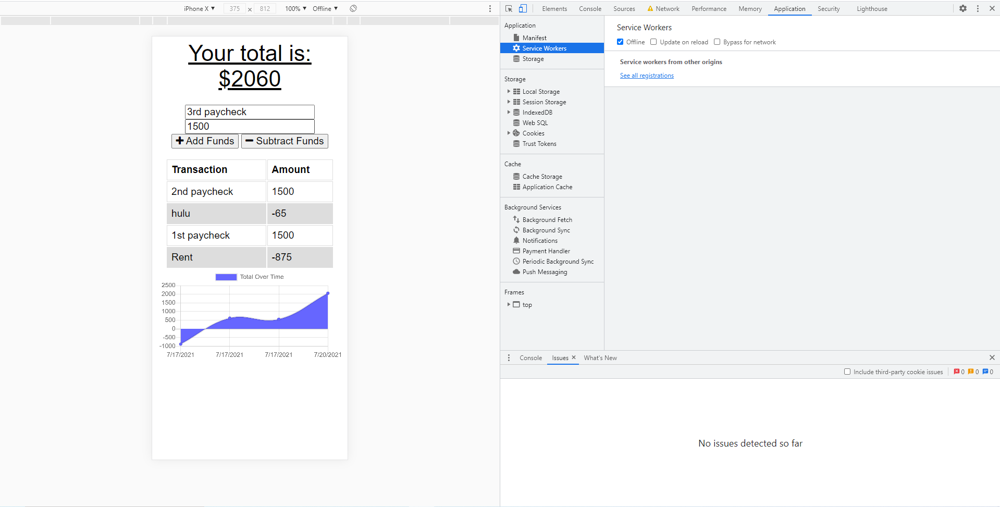
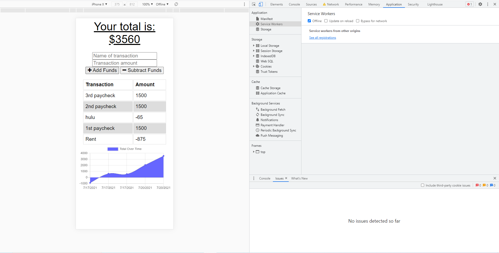
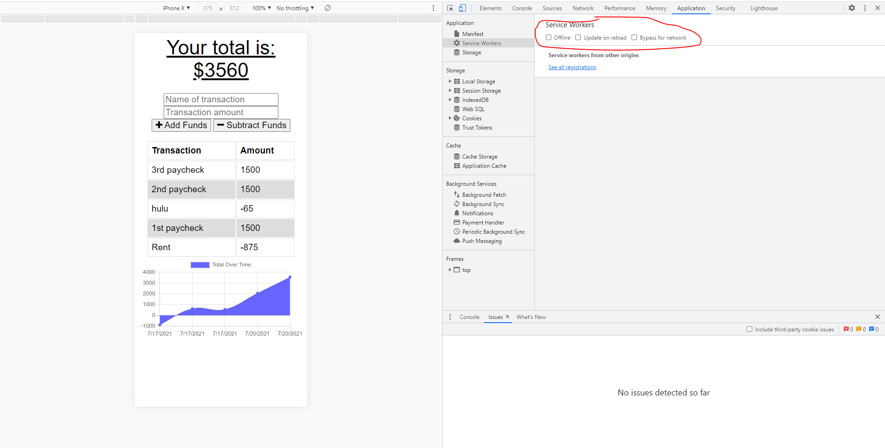

# Web-Performance/BudgetTracker 
https://github.com/mdis928/Web-Performance

## Description
The goal for for this homework was to create and a budget tracker. When you are offline, you can add revenue and expenses but not burn up data. When you have wifi, go back online and the budget tracker will update with your offline revenue and expenses

## Table of Contents
* [Installiation](#installiation)
* [Usage](#usage)
* [License](#license)
* [Contributions](#contributions)
* [Test](#test)
* [Questions](#questions)
* [Deployment](#deployment)

## Installiations 
compression, express, lite-server, mongoose, morgan

## Usage
The point of the homework was to get to optimizing the performance of web applications by using progression web applications (PWAs). The PWAs help web apps perform better on mobile devices. In this homework, the service worker and cache apis were utilized so that the web app can work even offline 

## License
This project is licensed under: []

## Contributions
Contributors: Michael DiSanto

## Tests
To test, you will need to toggle the offline in performance or application in devtools (F12). When you are offline, add your revenue or expenses. Then click offline again so that you are online and refresh the page. There you will see the updates.

## Questions
If you have any questions about the repo, contact Michael DiSanto at mdis928 via github or mdisanto928@gmail.com via email

## Deployment
https://mdis-budgettracker.herokuapp.com/

